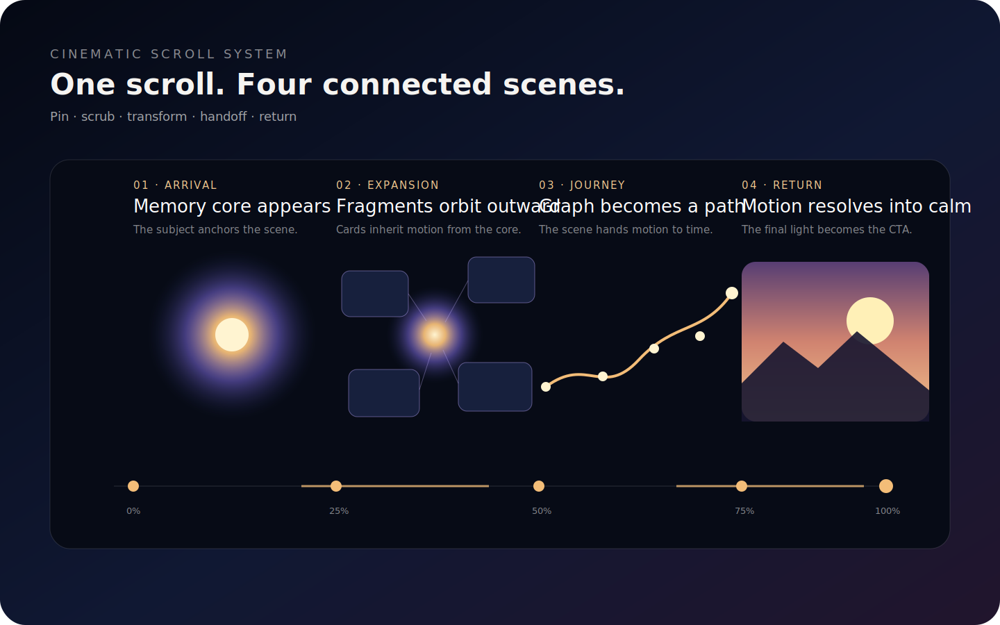

# Cinematic Web Experience Designer

这是一个用于生成高级动态网页的双语 Skill 包。



## 它解决什么问题

普通 AI 前端往往直接从需求跳到组件拼装。本 Skill 在编码前增加视觉导演层，强制定义视觉世界、页面分幕、媒体职责、滚动时间轴、场景交接、移动端重新导演以及性能降级。

## 文件说明

- `SKILL.md`：英文主 Skill，可用于通用 Agent 或 Codex 工作流。
- `SKILL.zh-CN.md`：中文完整版本。
- `templates/visual-brief.*.md`：项目视觉简报。
- `templates/scene-spec.yaml`：页面分幕规格。
- `templates/media-plan.yaml`：图片、视频、3D 和 Shader 媒体规划。
- `templates/motion-timeline.yaml`：统一动效与滚动编排时间轴，包含 Trigger、Pin、Scrub、媒体同步和场景交接。
- `templates/qa-checklist.md`：视觉、性能和可访问性验收。
- `prompts/codex-execution.*.md`：交给 Codex 的分阶段执行提示词。
- `examples/tongxing-memory-growth-space.zh-CN.md`：同行项目完整滚动叙事示例。
- `examples/scroll-scene-gsap.tsx`：React + GSAP ScrollTrigger 可运行参考场景。
- `examples/scroll-scene.css`：参考场景样式。

## 推荐使用顺序

1. 填写 `visual-brief.zh-CN.md`。
2. 使用 Skill 的概念模式生成三个视觉方向。
3. 选定方向后填写 `scene-spec.yaml`。
4. 为所有素材填写 `media-plan.yaml`。
5. 为重动效场景填写 `motion-timeline.yaml`。
6. 将规格和 `codex-execution.zh-CN.md` 一起交给 Codex。
7. Codex 每次只完成一个阶段或一个场景。
8. 先用占位素材验证滚动原型，再接入正式视频、图片或 WebGL。
9. 输出 0%、25%、50%、75%、100% 进度截图和桌面/手机滚动录屏。
10. 使用 `qa-checklist.md` 完成最终验收。

## 关键原则

先导演，后设计；先设计，后编码；先桌面与手机双分镜，再进入实现；每一个重效果都必须有降级方案。

## 参考代码依赖

`examples/scroll-scene-gsap.tsx` 使用：

```bash
npm install gsap @gsap/react
```

示例只负责视觉场景和滚动时间轴，不应承载聊天、用户资料或数据库等业务状态。接入正式项目时，需要把场景状态与业务状态分离。
